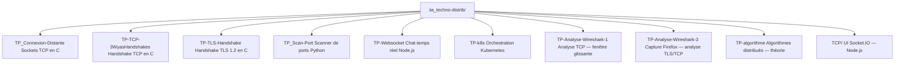
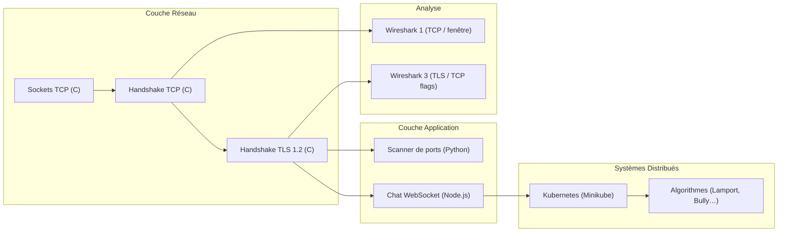
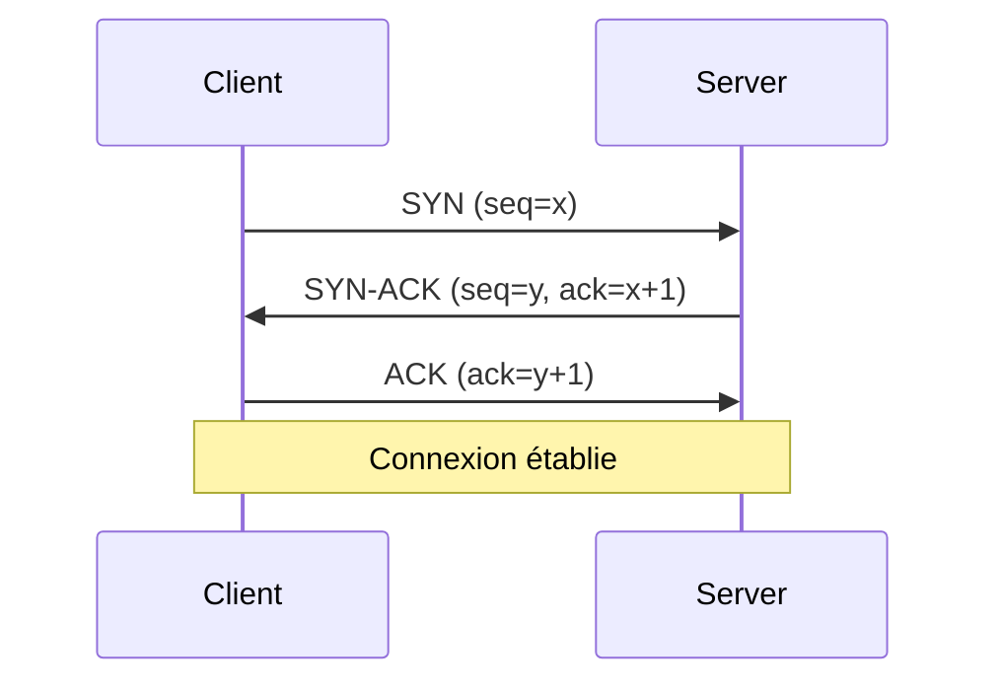
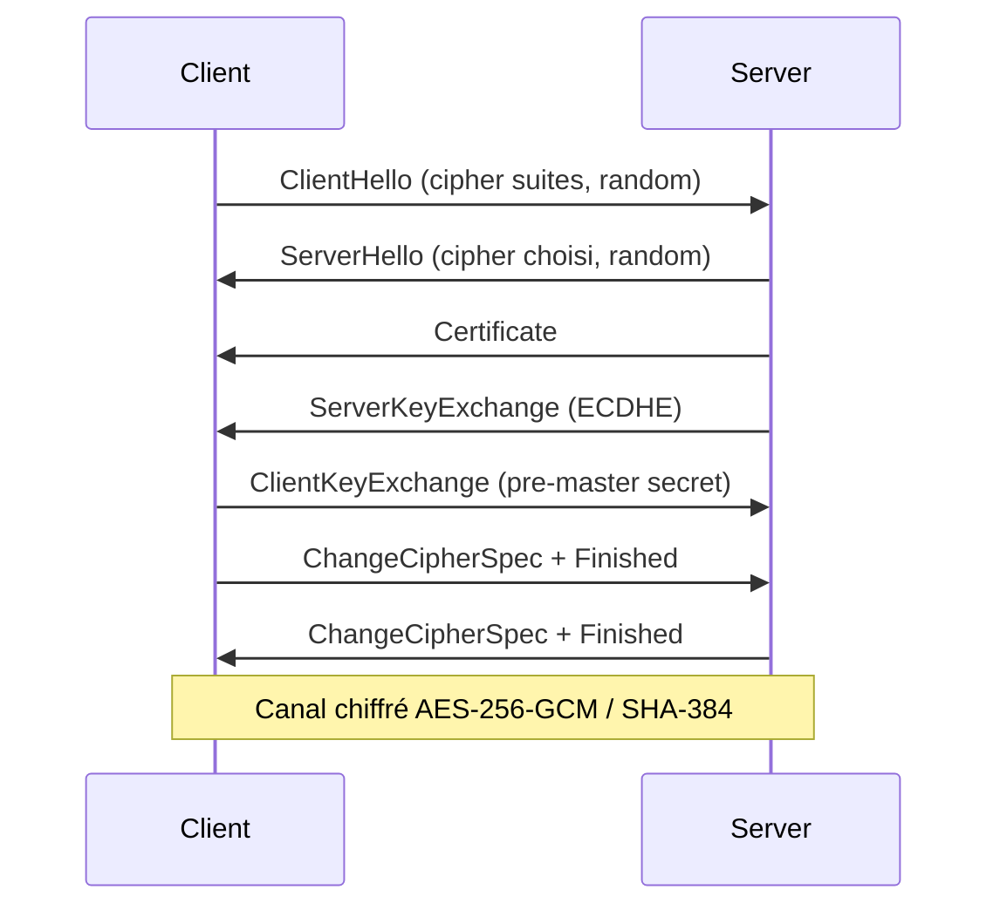
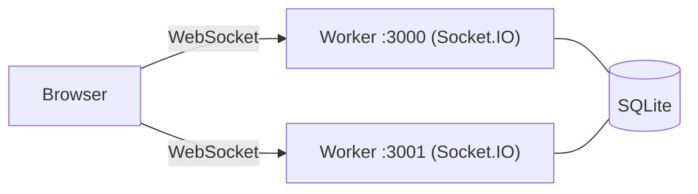
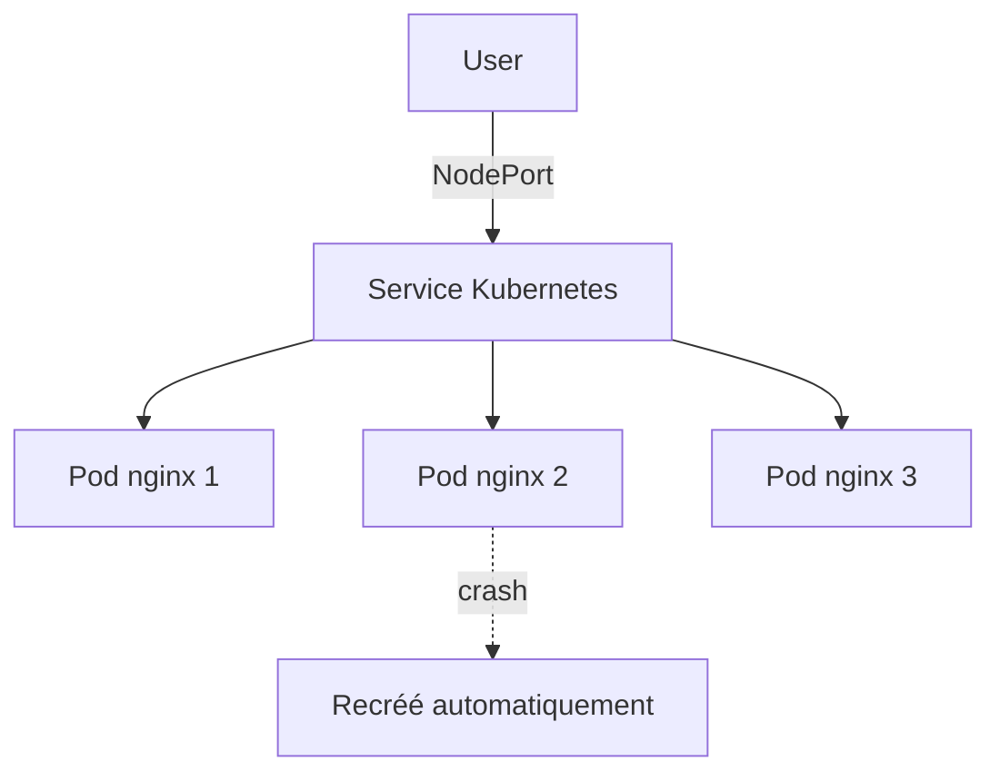

# iia_techno-distrib

Dépôt de travaux pratiques sur les **systèmes distribués et la programmation réseau** réalisés en école.

---

## Structure du dépôt



---

## Progression pédagogique



---

## TPs en détail

### TP_Connexion-Distante — Sockets TCP (C)
Introduction à l'API POSIX des sockets. Un client et un serveur s'échangent des messages en TCP.

```bash
make && ./server &  ./client
```

---

### TP-TCP-3WyasHandshakes — Handshake TCP (C)
Simulation manuelle du three-way handshake : SYN → SYN-ACK → ACK avec génération des numéros de séquence.



> Requiert les droits root (raw sockets).

---

### TP-TLS-Handshake — Handshake TLS 1.2 (C)
Simulation d'une négociation TLS 1.2 complète : échange de clés, suite de chiffrement, dérivation du secret.



---

### TP_Scan-Port — Scanner de ports (Python)
Scan des ports courants d'une cible, export JSON, suite de tests pytest incluse.

```bash
pip install -r requirements.txt
python scanner.py <ip>
```

Ports analysés : 22, 80, 443, 3306, 5432…

---

### TP-Websocket — Chat temps réel (Node.js)
Application de chat avec Socket.IO, clustering (2 workers), persistance SQLite et récupération des messages après reconnexion.



```bash
npm install && node index.js
```

---

### TP-k8s — Orchestration Kubernetes (Minikube)
Déploiement d'un service nginx, mise à l'échelle, load balancing et auto-guérison des pods.



```bash
kubectl apply -f deployment.yaml
kubectl apply -f service.yaml
kubectl scale deployment nginx-deployment --replicas=3
```

---

### TP-Analyse-Wireshark-1 & 3 — Analyse réseau
Exercices d'analyse de captures pcapng : fenêtre glissante TCP, calcul de débit, flags TCP, handshake TLS dans du trafic Firefox réel.

---

### TP-algorithme — Algorithmes distribués (théorie)
Exercices sur les concepts fondamentaux des systèmes distribués :

| Algorithme | Concept |
|---|---|
| Horloges de Lamport | Ordre causal des événements |
| Horloges vectorielles | Causalité distribuée |
| Algorithme de Bully | Élection de leader |
| Consensus | Accord malgré les pannes |
| Exclusion mutuelle | Accès aux ressources partagées |
| Quorum | Réplication et cohérence |
| Heartbeat | Détection de pannes |

---

## Technologies

| Langage / Outil | Usage |
|---|---|
| C | Simulation de protocoles réseau (TCP, TLS) |
| Python | Scanner de ports, tests unitaires (pytest) |
| Node.js / Socket.IO | Chat WebSocket temps réel |
| Kubernetes / Minikube | Orchestration de conteneurs |
| Wireshark | Analyse de captures réseau (pcapng) |
| SQLite | Persistance des messages |
| Docker | Conteneurs nginx pour k8s |
| Make | Compilation des projets C |