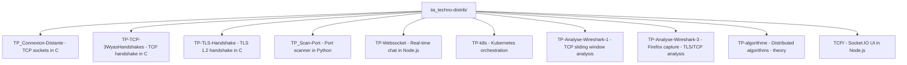
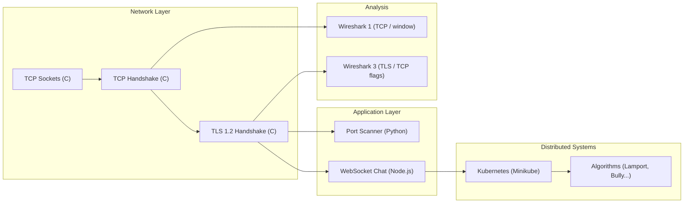
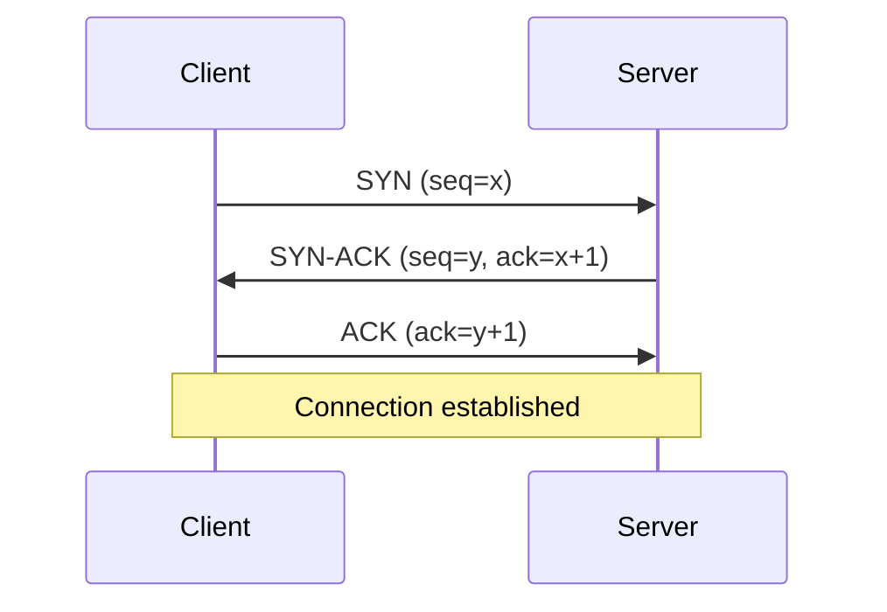
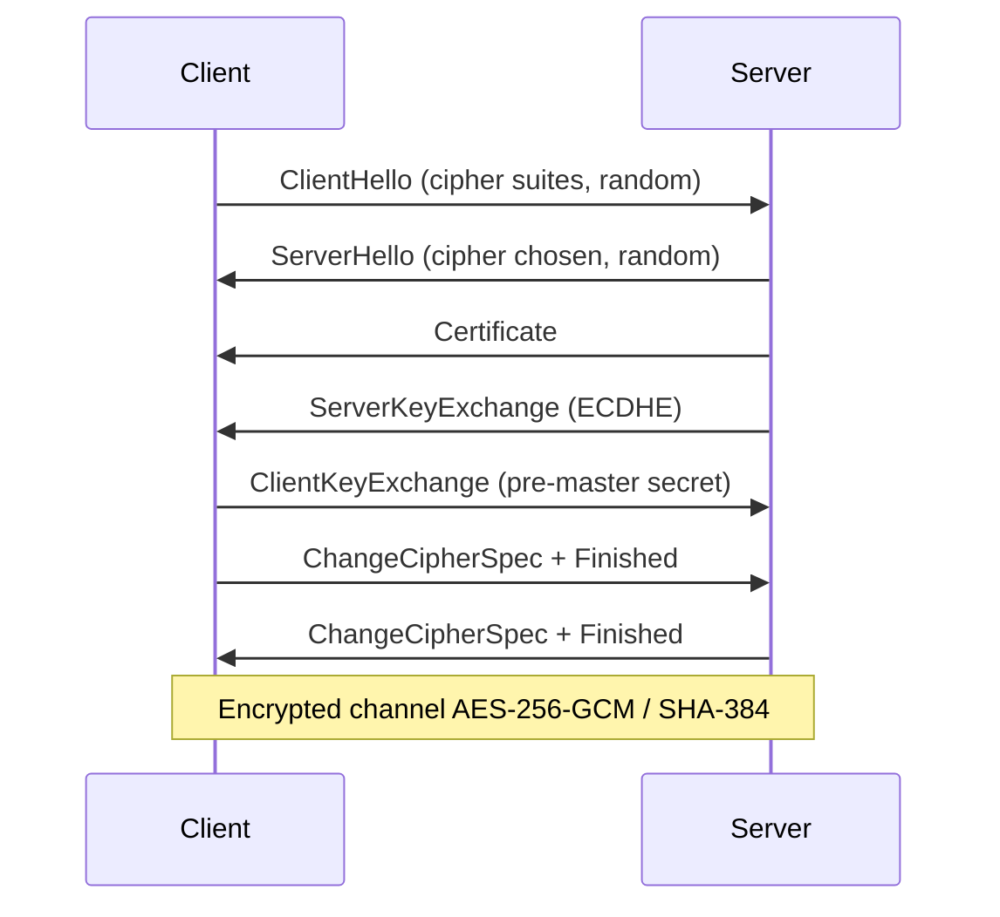
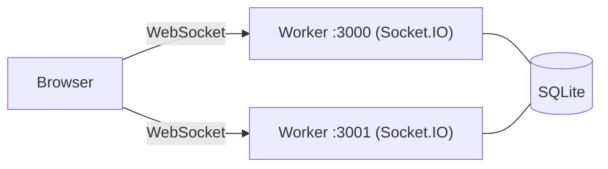
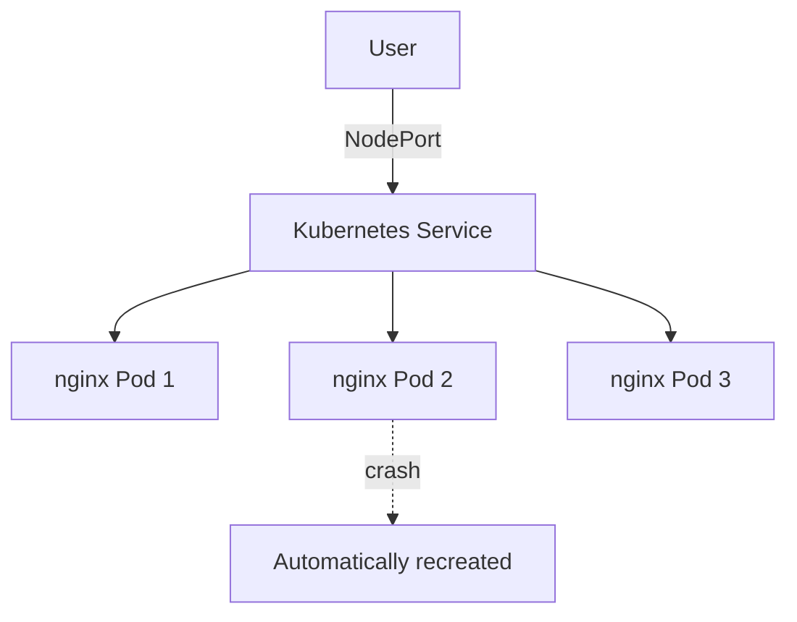

# iia_techno-distrib


Practical labs on **distributed systems and network programming**, done at school. Covers TCP/TLS socket programming in C, port scanning in Python, real-time WebSocket chat in Node.js, Kubernetes orchestration, Wireshark traffic analysis, and distributed algorithm theory.

---

## Overview



### Learning progression



---

## Usage

### TP_Connexion-Distante - TCP sockets (C)

Introduction to the POSIX socket API. A client and a server exchange messages over TCP.

```bash
make && ./server & ./client
```

---

### TP-TCP-3WyasHandshakes - TCP handshake (C)

Manual simulation of the three-way handshake: SYN - SYN-ACK - ACK with sequence number generation.



> Requires root privileges (raw sockets).

---

### TP-TLS-Handshake - TLS 1.2 handshake (C)

Full TLS 1.2 negotiation simulation: key exchange, cipher suite selection, secret derivation.



---

### TP_Scan-Port - Port scanner (Python)

Scans common ports of a target, exports JSON results, includes a pytest test suite.

```bash
pip install -r requirements.txt
python scanner.py <ip>
```

Ports scanned: 22, 80, 443, 3306, 5432...

---

### TP-Websocket - Real-time chat (Node.js)

Chat application with Socket.IO, clustering (2 workers), SQLite persistence and message recovery after reconnection.



```bash
npm install && node index.js
```

---

### TP-k8s - Kubernetes orchestration (Minikube)

Deploy an nginx service, scale it, configure load balancing and pod self-healing.



```bash
kubectl apply -f deployment.yaml
kubectl apply -f service.yaml
kubectl scale deployment nginx-deployment --replicas=3
```

---

## Specificities

### TP-Analyse-Wireshark-1 and 3 - Network analysis

pcapng capture analysis exercises: TCP sliding window, throughput calculation, TCP flags, TLS handshake in real Firefox traffic.

---

### TP-algorithme - Distributed algorithms (theory)

| Algorithm | Concept |
|---|---|
| Lamport clocks | Causal ordering of events |
| Vector clocks | Distributed causality |
| Bully algorithm | Leader election |
| Consensus | Agreement despite failures |
| Mutual exclusion | Shared resource access |
| Quorum | Replication and consistency |
| Heartbeat | Failure detection |

---

### Technologies

| Language / Tool | Usage |
|---|---|
| C | Network protocol simulation (TCP, TLS) |
| Python | Port scanner, unit tests (pytest) |
| Node.js / Socket.IO | Real-time WebSocket chat |
| Kubernetes / Minikube | Container orchestration |
| Wireshark | Network capture analysis (pcapng) |
| SQLite | Message persistence |
| Docker | nginx containers for k8s |
| Make | C project compilation |

---

## License

MIT
