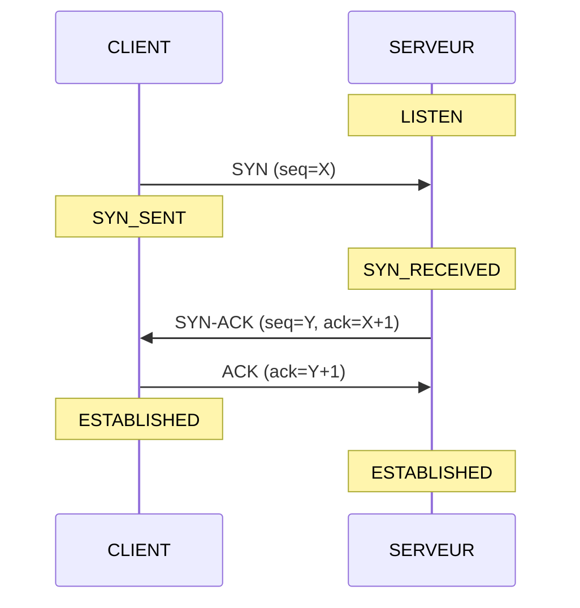

# TCP Three-Way Handshake en C

Simulation bas niveau du handshake TCP en C.

## Principe en mermaid



## Ce que fait le code

| Fichier    | Rôle |
|------------|------|
| `client.c` | Envoie SYN, attend SYN-ACK, envoie ACK final |
| `server.c` | Attend SYN sur le port 4444, répond SYN-ACK, attend l'ACK final |


## Compilation

```bash
make
```

## Exécution

> Nécessitent les droits **root**

### 1. Lancer le serveur

```bash
sudo ./server <ip_serveur>
# Exemple sur loopback :
sudo ./server 127.0.0.1
```

### 2. Lancer le client (dans un autre terminal si aussi localhost)

```bash
sudo ./client <ip_client> <ip_serveur>
# Exemple sur loopback :
sudo ./client 127.0.0.1 127.0.0.1
```

## Exemple de sortie

**Serveur :**
```
╔══════════════════════════════════════════════╗
║  TCP Three-Way Handshake  —  SERVEUR         ║
╚══════════════════════════════════════════════╝
IP serveur : 127.0.0.1   Port : 4444

État initial : LISTEN
En attente d'un SYN...

┌─ Étape 1/3 : SYN reçu ──────────────────────┐
│  De        : 127.0.0.1:5555
│  Seq client: 1823456789
│  Flags     : SYN=1 ACK=0
└──────────────────────────────────────────────┘
État : LISTEN → SYN_RECEIVED

┌─ Étape 2/3 : SYN-ACK envoyé ───────────────┐
│  Vers      : 127.0.0.1:5555
│  Seq srv   : 987654321
│  Ack       : 1823456790  (client_seq + 1)
│  Flags     : SYN=1 ACK=1
└──────────────────────────────────────────────┘

┌─ Étape 3/3 : ACK reçu ──────────────────────┐
│  De        : 127.0.0.1:5555
│  Ack       : 987654322  (server_seq + 1)
│  Flags     : SYN=0 ACK=1
└──────────────────────────────────────────────┘
État : SYN_RECEIVED → ESTABLISHED

══════════════════════════════════════════════
  CONNEXION ÉTABLIE — Handshake terminé !
══════════════════════════════════════════════
```

## Détails

### Structures utilisées
- `struct iphdr` — en-tête IPv4 (Linux `<netinet/ip.h>`)
- `struct tcphdr` — en-tête TCP (Linux `<netinet/tcp.h>`)
- `struct pseudo_header` — pseudo en-tête pour le checksum TCP

### Checksum TCP
Le checksum TCP couvre un en-tête (adresses IP source/dest, protocole, longueur TCP) concaténé à l'en-tête TCP

### ISN
Généré aléatoirement via `rand()` pour les deux côtés
