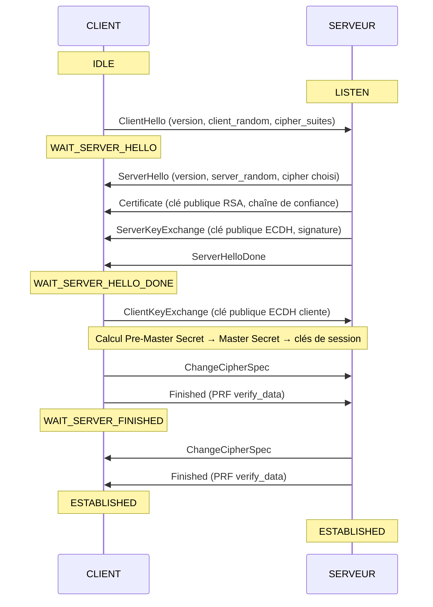

# TLS Handshake en C

Simulation illustrée du handshake TLS en C.  
Les messages échangés sont des marqueurs textuels sur un socket TCP classique ; les valeurs cryptographiques (randoms, clés, hashes) sont générées avec `rand()`

## Principe en mermaid



## Ce que fait le code

| Fichier    | Rôle |
|------------|------|
| `client.c` | Initie le handshake, envoie ClientHello → ClientKeyExchange → ChangeCipherSpec → Finished, vérifie le Finished serveur |
| `server.c` | Répond avec ServerHello + Certificate + ServerKeyExchange + ServerHelloDone, puis valide le Finished client et envoie le sien |

## Compilation

```bash
make
```

## Exécution

### 1. Lancer le serveur

```bash
./server
```

### 2. Lancer le client (dans un autre terminal)

```bash
./client <ip_serveur>
# Exemple sur loopback :
./client 127.0.0.1
```

## Exemple de sortie

**Serveur :**
```
╔══════════════════════════════════════════════╗
║  TLS 1.2 Handshake  —  SERVEUR               ║
╚══════════════════════════════════════════════╝
Port : 4433

État initial : LISTEN
En attente d'une connexion...

Connexion TCP établie depuis 127.0.0.1:54321

┌─ Étape 1 : ClientHello reçu ────────────────┐
│  De             : 127.0.0.1:54321
│  Version        : TLS 1.2 (0x0303)
│  Client Random  : a3 f2 01 bc 44 ... (16 octets)
│  Cipher Suites  : TLS_ECDHE_RSA_WITH_AES_256_GCM_SHA384
│  Extensions     : SNI, ALPN, session_ticket
└──────────────────────────────────────────────┘
État : LISTEN → WAIT_CLIENT_KEY_EXCHANGE

...

══════════════════════════════════════════════
  SESSION TLS ÉTABLIE — Handshake terminé
  Chiffrement : AES-256-GCM
  Intégrité   : SHA-384
══════════════════════════════════════════════
```

## Détails

### Messages TLS :

| Message | Émetteur | Contenu simulé |
|---------|----------|----------------|
| `ClientHello` | Client | version, client_random, liste de cipher suites |
| `ServerHello` | Serveur | version, server_random, cipher suite retenue, session ID |
| `Certificate` | Serveur | sujet, émetteur, validité, clé publique RSA 2048 |
| `ServerKeyExchange` | Serveur | courbe ECDH (secp256r1), clé publique, signature RSA-SHA256 |
| `ServerHelloDone` | Serveur | fin des messages serveur |
| `ClientKeyExchange` | Client | clé publique ECDH du client |
| `ChangeCipherSpec` | Client + Serveur | bascule sur le chiffrement négocié |
| `Finished` | Client + Serveur | PRF verify_data (hash du handshake complet) |

### Dérivation des clés (Aidé par l'IA) :
```
Pre-Master Secret  = ECDH(client_priv, server_pub)
Master Secret      = PRF(pre_master, "master secret", client_random + server_random)
Clés de session    = PRF(master_secret, "key expansion", server_random + client_random)
                     → client_write_key, server_write_key, client_write_IV, server_write_IV
```

### Différences avec TLS 1.3

| | TLS 1.2 | TLS 1.3 |
|---|---------|---------|
| Aller-retours | 2-RTT | 1-RTT (voire 0-RTT) |
| ServerKeyExchange | Optionnel | Intégré au ServerHello via `key_share` |
| ChangeCipherSpec | Explicite | Supprimé |
| Chiffrement du Finished | Non | Oui (tout chiffré dès ServerHello) |


### Déf Cipher Suites :

Une cipher suite est une combinaison d'algorithmes cryptographiques utilisés ensemble pour sécuriser une connexion TLS. Elle définit 4 choses :
- ECDHE : Comme ED25519, le client et serveur se mettent d'accord sur une clé secrète sans se l'envoyer directement
- RSA : Le serveur prouve son identité via son certificat
- AES-256-GCM : Les données sont chiffrées une fois la session établie
- SHA-384 : Vérification que les données n'ont pas été altérées
