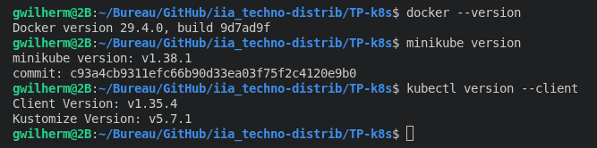
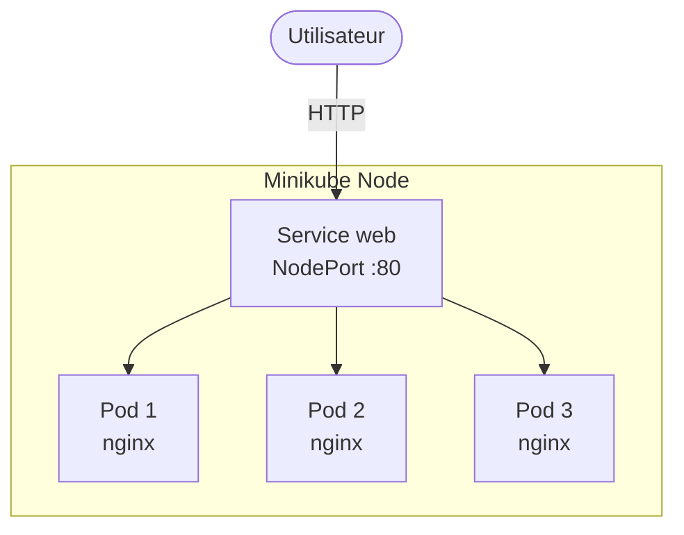
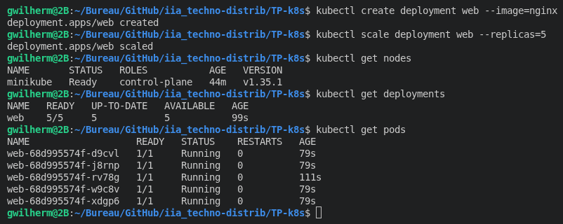
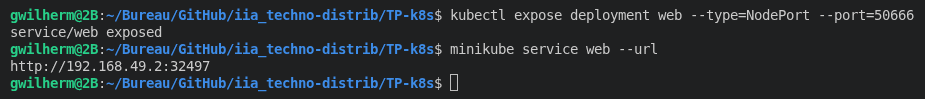
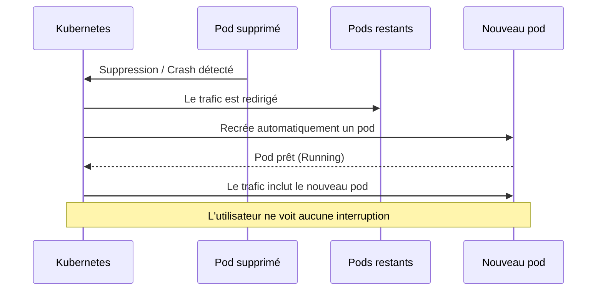

# TP Kubernetes — Systèmes distribués

## Stack utilisée



| Outil | Version |
|-------|---------|
| Docker | 29.4.0 |
| Minikube | v1.38.1 |
| kubectl (Client) | v1.35.4 |
| Kustomize | v5.7.1 |

---

## Architecture du cluster



---

## Étapes du TP

### 1. Initialisation du cluster Minikube

```bash
kubectl get nodes
```

```
NAME       STATUS   ROLES           AGE   VERSION
minikube   Ready    control-plane   44s   v1.35.1
```

Un seul nœud `control-plane` est actif — c'est le cluster Minikube local.

---

### 2. Déploiement de l'application

```bash
kubectl create deployment web --image=nginx
```

```bash
kubectl get deployments
```

```
NAME   READY   UP-TO-DATE   AVAILABLE   AGE
web    1/1     1            1           16s
```

```bash
kubectl get pods
```

```
NAME                   READY   STATUS    RESTARTS   AGE
web-68d995574f-vpr9p   1/1     Running   0          40s
```

> **Définition** : un **pod** correspond à une instance de l'application.  
> Ici, un seul pod Nginx tourne — une seule instance.

---

### 3. Passage à l'échelle (Scaling)

```bash
kubectl scale deployment web --replicas=3
```

```bash
kubectl get pods
```

```
NAME                   READY   STATUS    RESTARTS   AGE
web-68d995574f-8ck2v   1/1     Running   0          5s
web-68d995574f-lj4x5   1/1     Running   0          5s
web-68d995574f-vpr9p   1/1     Running   0          5m43s
```



On passe de 1 à 3 pods Nginx formant un **cluster** avec **load balancing**.

---

### 4. Exposition du service

```bash
kubectl expose deployment web --type=NodePort --port=80
minikube service web --url
```



Le service est accessible via l'URL retournée par Minikube.  
Le trafic entrant est automatiquement réparti entre les 3 pods.

---

### 5. Simulation d'une panne (Self-healing)

```bash
kubectl get pods
kubectl delete pod web-68d995574f-vpr9p
```

```bash
kubectl get pods
```

```
NAME                   READY   STATUS    RESTARTS   AGE
web-68d995574f-8ck2v   1/1     Running   0          6m30s
web-68d995574f-lj4x5   1/1     Running   0          6m30s
web-68d995574f-xhnxz   1/1     Running   0          25s   ← nouveau pod
```



Kubernetes détecte la disparition du pod et en recrée un automatiquement, **sans interruption de service**.

---

### 6. Nettoyage

```bash
kubectl delete service web
kubectl delete deployment web
minikube stop
```

---

## Questions du TP

### 1. Quelle est la différence entre un système centralisé et distribué ?

Système centralisé : Un seul nœud serveur détient toutes les ressources et la logique, les clients s'y connectent donc pour tout traitement.
Système distribué : Plusieurs nœuds indépendants collaborent pour accomplir une tâche. Chaque nœud possède une partie des ressources ou de la logique.

Tableau de comparaison :

| Critère | Système centralisé | Système distribué |
|---------|--------------------|-------------------|
| Complexité |	Faible car nous n'avons qu'un équipement à gérer |	Élevée car nous avons plusieurs équipements à gérer et lier |
| SPOF (Signle Point of Failure) | Oui car si le serveur tombe, tout tombe | Généralement non car il y a des systèmes de tolérence aux fautes et répartisseur de charge |
| Scalabilité |	Ajout de ressources sur la machine, ce qui devient vite coûteux | Ajout de noeuds (Moins coûteux) |
| Cohérence des données | 1 seul noeud donc aucun besoin de synchro |	Problème de synchro (Concurrence, ordres des évènements, détection de panne...) à résoudre à l'aide de divers algorithmes |


### 2. Pourquoi utiliser plusieurs instances d'une application ?

L'utilisation de plusieurs instances d'une application nous renvoie vers un système dit distribué. Cela permet de répondre à plusieurs critères comme : 
- La tolérence aux pannes en gardant l'application disponible malgré la panne d'une ou plusieurs instances.
- La disponibilité de l'application.
- La persistence des données car ils sont répliqué ou partagé entre plusieurs instances.

### 3. Que se passe-t-il si un pod tombe en panne ?

Dans le cas de Kubernetes / Minikube lorsqu'un pod tombe en panne, un nouveau pod est recréé automatiquement en s'ajoutant au cluster de l'application.

### 4. Qu'est-ce que la tolérance aux fautes ?

La tolérance aux fautes est la capacité d'un système à continuer de fonctionner malgré la défaillance d'un ou plusieurs de ses composants.
Il fonctionne avec plusieurs principes :
- Redondance en dupliquant les composants critiques
- Réplication en copiant les données sur plusieurs noeuds
- Failover en basculant automatiquement les composants et noeufs en cas de panne
- Heartbeat qui envoie un signal régulier (comme un battement de coeur) pour détecter les noeuds vivants.

Exemple avec Kubernetes :
Un pod crash → Kubernetes le détecte via le heartbeat → il recrée automatiquement un pod sur un autre nœud en le liant au cluster en place → l'utilisateur ne voit rien

### 5. Kubernetes garantit-il la haute disponibilité ?

Kubernetes garantit la haute disponibilité (Système accessible même en cas de panne partielle) mais en devant activer plusieurs mécanismes :
- ReplicaSet : Maintient N copies d'un pod en permanence
- Self-healing : Recrée automatiquement un pod qui crash (Ce qu'on a démontré dans le TP précédemment)
- Liveness/Readiness probes	: Détecte si un pod est sain avant d'y envoyer du trafic
- Multi-node cluster : Répartit les pods sur plusieurs machines physiques

### 6. Quel est le rôle du load balancing ?

Le rôle du load balancing est de répartir le trafic entrant entre plusieurs instances d'un service (Par exemple : Netscaler ADC qui est un reverse-proxy permettant de rediriger vers plusieurs serveurs des flux entrants).

Objectifs :
- Éviter la surcharge d'un seul nœud
- Masquer les pannes : si une instance tombe, le trafic est redirigé vers les autres
- Scalabilité : ajouter des instances sans changer le point d'entrée

### 7. Plus il y a de réplicas, plus le système est-il fiable ? Pourquoi ?

Plus il y a de pods, plus le système est fiable car plus il est tolérent aux pannes via le load balancer qui redirigera le trafic vers les pods restants.
Cependant, la fiabilité dépend aussi d'autres facteurs dans le cas de Kubernetes :
- Les pods doivent être répartis sur plusieurs nœuds car si le noeud centrale avec tous les pods tombe, le service tombe
- La base de données doit aussi être répliquée car un seul pod BDD reste un Single Point of Failure car si elle tombe, le service ou l'app n'aura plus aucune donnée.
- Le réseau entre pods doit également être fiable également pour des raisons de sécurité car un attaquant pourra surcharger ce réseau pour provoquer un déni de service
